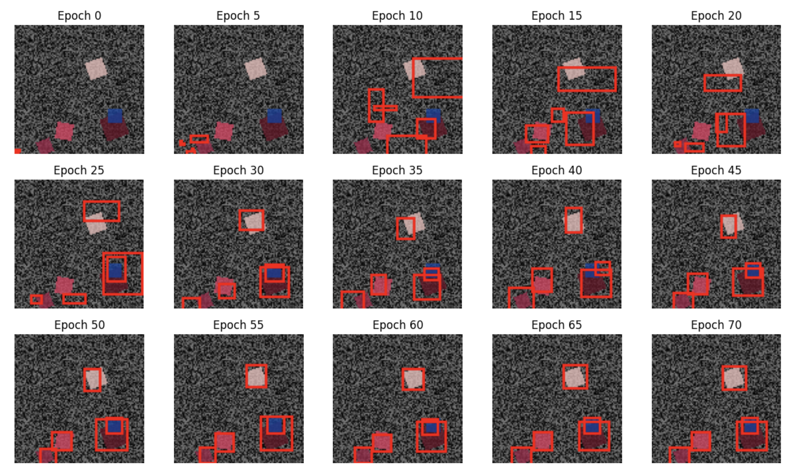
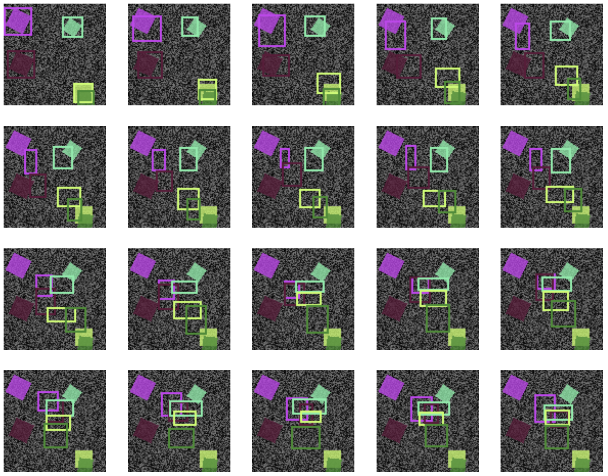

# Research question:

Can use a diffusion process to predict a variable amount of bounding boxes at once?

_this project was halted halfway through. There is an autoregressive model that predicts bounding boxes, but the whole idea was to do them simultaneously._

# Autoregressive model predictions during training:

# Forward bounding box diffusion process (unused because there is no diffusion model yet):

